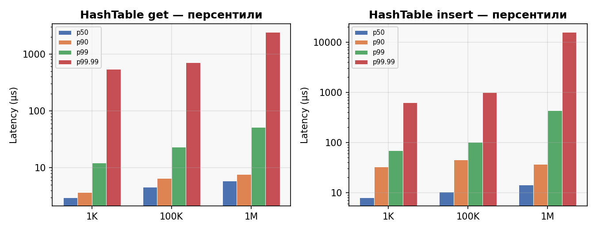

# Отчёт по результатам JMH-бенчмарков

**Окружение:** macOS Darwin 25.3.0 · `@Fork(1)` · `@Warmup(3×2s)` · `@Measurement(5×2s)`
**Профилирование:** async-profiler 4.0 · `-prof async:output=jfr` · flame graphs + JSON
**Размеры данных:** N = 1 000 / 100 000 / 1 000 000

---

## 1. ExtendibleHashTable

Файловый расширяемый хеш-индекс с одним файлом на бакет. Операции ввода-вывода выполняются через позиционное чтение и запись `FileChannel`. Параметры: `bucketCapacity = 64`, `maxOpenChannels = N/16 + 128`.

### 1.1 Средние задержки (µs/op)

### 1.2 Использование дискового пространства

| N | bytes/entry |
|---|------------:|
| 1K | 37 |
| 100K | 41 |
| 1M | 43 |

Каждая запись состоит из 2-байтового префикса длины ключа, самого ключа (~25 символов), 4-байтового префикса длины значения и значения (~8–13 байт). При росте N средний размер ключа увеличивается на пару символов, поэтому расход растёт с 37 до 43 байт на запись. Метаданные бакетов (8 байт заголовка на бакет) амортизируются по всем записям внутри бакета.

### 1.3 Персентильные задержки (SampleTime, µs)

#### benchGet — только чтение, один вызов `readBucket`

| N | p50 | p90 | p99 | p99.9 | p99.99 | p100 |
|---|----:|----:|----:|------:|-------:|-----:|
| 1K | 3 | 3.71 | 12.2 | 71.7 | 547 | 2 482 |
| 100K | 4.58 | 6.54 | 23.1 | 106 | 711 | 5 775 |
| 1M | 5.91 | 7.74 | 51.7 | 291 | 2 432 | 14 828 |

Медиана растёт предсказуемо: 3 → 4.6 → 5.9µs (по `results.json`, SampleTime, те же данные, что на графиках в `docs/benchmark_charts.ipynb`). При N=1K и N=100K рабочее множество файлов бакетов (~1.5MB) целиком умещается в L3-кэш процессора. При N=1M объём файлов достигает ~15MB при ~15 000 бакетов — это превышает ёмкость L3, однако page cache операционной системы удерживает медиану около 6µs. Отношение p90/p50 нарастает с ~1.24 (1K) до ~1.31 (1M) — хвосты тяжелее из-за редких долгих чтений.

#### benchUpdate — `readBucket` + условный `writeBucket`

| N | p50 | p90 | p99 | p99.9 | p99.99 | p100 |
|---|----:|----:|----:|------:|-------:|-----:|
| 1K | 5.66 | 9.2 | 29.6 | 123 | 729 | 1 178 |
| 100K | 7.33 | 11.5 | 32.4 | 172 | 900 | 2 814 |
| 1M | 47.6 | 59.6 | 143 | 597 | 3 151 | 42 074 |

При N=1K и N=100K разница с get составляет ~2–3µs — это стоимость двух дополнительных системных вызовов (`ch.truncate()` + `ch.write()`). При N=1M медиана резко прыгает до ~48µs: рабочее множество ~15MB не помещается в L3, и каждая пара read+write обращается к DRAM. Высокий p100 при N=1M отражает в том числе периодический сброс грязных страниц в page cache ОС.

> Примерно половина вызовов update не выполняет запись: ключи `keys[N/2..N]` отсутствуют в таблице и обрабатываются по короткому пути с ранним возвратом.

#### benchInsert — ограниченный пул ключей, steady-state upsert

| N | p50 | p90 | p99 | p99.9 | p99.99 | p100 |
|---|----:|----:|----:|------:|-------:|-----:|
| 1K | 7.95 | 32.8 | 68.6 | 163 | 622 | 3 031 |
| 100K | 10.4 | 45.7 | 102 | 323 | 997 | 7 184 |
| 1M | 14.4 | 37.1 | 437 | 3 595 | 15 892 | 24 936 |

Широкий разрыв между p50 и p90 на 1K (8.0 против 32.8µs) и на 100K (10.4 против 45.7µs) объясняется периодическими сплитами бакетов. При N=1M хвостовая задержка p99.9 достигает ~3.6ms — это глубокие сплиты при `globalDepth` ~14, когда приходится читать и записывать два бакета и обновлять массив директории.

#### benchDelete — чередование `delete()` и `insert()` через трекер `deleted[]`

| N | p50 | p90 | p99 | p99.9 | p99.99 | p100 |
|---|----:|----:|----:|------:|-------:|-----:|
| 1K | 27.7 | 43.1 | 79.1 | 302 | 1 642 | 8 536 |
| 100K | 44.9 | 60.7 | 169 | 861 | 4 040 | 13 009 |
| 1M | 48.9 | 80.9 | 240 | 1 095 | 6 261 | 46 858 |

Каждый вызов гарантированно выполняет запись: либо удаление (read + write), либо повторную вставку (read + write, иногда со сплитом). Именно поэтому медиана примерно в 8–10 раз выше, чем у get на малых N и остаётся существенно выше на 1M.

---

### 1.4 История оптимизаций

#### Раунд 1 → 2: размер LRU-кэша FileChannel

| Operation | Before (N=100K) | After (N=100K) | Improvement |
|-----------|----------------:|---------------:|-------------|
| get       | 26.5µs | 4.3µs | **6.2×** |
| update    | 97.0µs | 17.9µs | **5.4×** |

Параметр `maxOpenChannels` был жёстко задан как 256. При N=100K и `bucketCapacity = 64` создаётся порядка 1 562 бакетов. LRU-кэш на 256 слотов давал 83.6% промахов — почти каждое обращение к бакету вызывало `FileChannel.open()` с выделением файлового дескриптора через системный вызов ядра. После исправления кэш масштабируется пропорционально числу бакетов.

#### Раунд 2 → 3: устранение аллокаций на каждую операцию

Каждый вызов `readBucket` выделял новый `ByteBuffer.allocate(fileSize)`. Каждый вызов `writeBucket` создавал `ByteArrayOutputStream` + `DataOutputStream` + вызывал `toByteArray()`, что означало два промежуточных объекта и полную копию буфера. При N=1M это порождало значительный поток короткоживущих объектов.

Вместо этого был введён единый переиспользуемый `ioBuf = ByteBuffer.allocate(max(4096, bucketCapacity * 128))`, разделённый между `readBucket` и `writeBucket`. Буфер автоматически растёт по стратегии удвоения ёмкости при необходимости.

#### Раунд 3 → 4: исправления методологии бенчмарков

**1. Двойное чтение в benchDelete.** Паттерн `if (!ht.delete(key)) ht.insert(key, val)` выполнял `readBucket` внутри `delete()` (ключ не найден), а затем ещё один `readBucket` внутри `insert()` — итого два чтения и одна запись вместо одного чтения и одной записи. Исправлено введением массива `deleted[]`, который отслеживает состояние каждого ключа и вызывает ровно ту операцию, которая нужна.

**2. Артефакт always-split в benchInsert.** Фаза подготовки заполняла таблицу на 100% ёмкости — каждая последующая вставка неизбежно вызывала сплит бакета. Измеренная медиана p50 ≈ 58µs отражала стоимость сплита, а не вставки. Исправлено заполнением только `dataSize / 2` ключей, чтобы бакеты оставались заполненными примерно наполовину.

---

### 1.5 Профиль CPU (async-profiler, N=1M)

| Operation | Syscalls | User code | JDK | MemCopy | Top hot method |
|-----------|--------:|----------:|----:|--------:|:---------------|
| **get**    | 52% | 12% | 27% | 6% | `pread` 25% |
| **update** | 84% | 4%  | 7%  | 3% | `ftruncate` 49% |
| **insert** | 74% | 9%  | 12% | 3% | `pwrite` 19%, `__unlink` 18% |
| **delete** | 86% | 4%  | 7%  | 1% | `ftruncate` 46% |

Все четыре операции ограничены вводом-выводом: от 52% (get) до 86% (delete) процессорного времени уходит на системные вызовы ядра. Пользовательский код (`ExtendibleHashTable.*`) занимает не более 12% — оптимизировать его бессмысленно без изменения стратегии ввода-вывода.

**`ftruncate` — доминирующий syscall для update и delete.** Вызов `ch.truncate(newSize)` перед `ch.write()` занимает 46–49% всего процессорного времени. Он срабатывает на каждую запись бакета, даже когда размер файла не изменился. Устранение этого единственного вызова сократит задержку update/delete почти вдвое.

**Insert: разнообразие syscalls.** В отличие от update, insert тратит время на `pwrite` (19%), `__unlink` (18%), `__open` (6%), `ftruncate` (5%). Высокая доля `__unlink` и `__open` отражает стоимость сплитов бакетов: создание нового файла, запись двух половин, удаление старого.

**Get: чистое чтение.** `pread` (25%) + `fstat` (16%) составляют 41% — это неизбежная стоимость позиционного чтения. Оставшиеся 11% syscall-времени приходятся на управление файловыми дескрипторами в LRU-кэше.

---

### 1.6 Оставшиеся узкие места

**`ftruncate` на каждую запись.** Профилирование подтвердило: 46–49% CPU при update/delete уходит на системный вызов `ftruncate`, который выполняется безусловно. Это главный bottleneck, устранимый проверкой `if (newSize < oldSize)`.

**Обрыв производительности записи при N=1M.** Медиана update скачет с ~7.3µs (N=100K) до ~47.6µs (N=1M), delete — с ~44.9µs до ~48.9µs. Причина структурная: ~15 000 файлов бакетов суммарным объёмом ~15MB не помещаются в L3-кэш процессора (~12MB), и каждая операция записи проваливается в DRAM.

**Хвостовые задержки p99.99.** На всех размерах p99.99 для get/update уходит в сотни µs — до ~1–3ms на 1M; у insert при N=1M p99.99 достигает ~16ms. Это в том числе паузы на GC safepoint и джиттер планировщика ОС — неустранимые в рамках JVM.

---

### 1.7 Возможные улучшения

**Пропуск `truncate` при неизменном размере** — вызывать `ch.truncate()` только когда новый размер бакета меньше предыдущего. По данным профилирования, устраняет 46–49% syscall-нагрузки для update/delete. Ожидаемое ускорение ~2×.

**Multi-bucket files** — размещение нескольких бакетов в одном файле-странице по 4KB вместо отдельного файла на каждый бакет. Сокращает число файлов с 15 000 до нескольких сотен при N=1M, устраняет обрыв производительности записи и избавляет от `__unlink`/`__open` при сплитах (18% + 6% в insert).

**Direct ByteBuffer** — использование `ByteBuffer.allocateDirect()` для `ioBuf` устраняет промежуточное копирование из кучи JVM в нативную память при `ch.read()`/`ch.write()`. По профилю, `jbyte_disjoint_arraycopy` занимает 3–6%.

**Слияние бакетов при удалении** — объединение бакетов-братьев, когда суммарная заполненность опускается ниже `capacity / 2`. Уменьшает общее число бакетов и улучшает утилизацию кэша.

---

## 2. RandomProjection LSH

In-memory LSH-индекс для поиска ближайших 3D-точек на основе p-stable L2 хеширования. Параметры: `numHashes = 64`, `numBands = 8`, `binWidth = 5.0`. Запрос: `findNear(Point3D(50, 50, 50), radius = 5.0)`.

### 2.1 Задержки

| N | ops/ms | µs/op | p50 (µs) | p90 (µs) | p99 (µs) | p99.9 (µs) | p100 (µs) |
|---|-------:|------:|---------:|---------:|---------:|------------:|----------:|
| 1K | 48.3 | 20.7 | 18.4 | 19.9 | 30.4 | 87.1 | 991 |
| 100K | 1 446 | 0.692 | 0.708 | 0.833 | 1.0 | 23.6 | 271 |
| 1M | 152.1 | 6.57 | 5.95 | 9.57 | 19.8 | 83.5 | 6 160 |

### 2.2 Потребление памяти

| N | bytes/entry |
|---|------------:|
| 1K | 1 658 |
| 100K | 1 060 |
| 1M | 666 |

Снижение удельного расхода памяти с ростом N объясняется амортизацией фиксированных затрат: 64 проекционных вектора, 8 хеш-таблиц полос, массив смещений. При N=1M удельный расход стабилизируется на ~666 байтах — это стоимость одного объекта `Entry` (строковый идентификатор, три координаты `Point3D`, `IntArray` из 64 хешей) плюс ссылки в бакетах 8 полос.

### 2.3 Анализ

Немонотонное поведение задержки — фундаментальное свойство LSH: стоимость запроса зависит от размера множества кандидатов в бакетах полос, а не от общего числа точек в индексе.

- **N=1K:** индекс содержит параметр `fullScanThreshold = 4000`. При количестве точек меньше этого порога `findNear` откатывается к полному перебору — медиана ~18.4µs отражает вычисление евклидова расстояния до всех 1 000 точек.
- **N=100K:** бакеты полос хорошо заполнены, но множество кандидатов остаётся небольшим. Медиана ~0.71µs, отношение p90/p50 ≈ 1.18 — стабильная задержка.
- **N=1M:** каждый из 8 бакетов полос содержит порядка 1M / 2⁸ ≈ 3 900 кандидатов. Проверка расстояния по объединению кандидатов (~10–30K точек после дедупликации) доминирует в общей стоимости: медиана ~5.95µs.

Отношение p99/p50 составляет ~1.4 при N=100K и ~3.3 при N=1M. Выбросы p100 (сотни µs и несколько ms) в основном связаны со сборщиком мусора и планировщиком ОС.

### 2.4 Профиль CPU (async-profiler, N=1M)

| Категория | Доля CPU | Основные методы |
|-----------|--------:|:----------------|
| User code | 29% | `findNear` 23%, `computeHash` 3% |
| GC (G1)   | 40% | `mark_in_bitmap` 10%, scrub / grey refs |
| JDK       | 24% | `HashMap.putVal` 6%, `HashMap.resize` 5%, `TimSort.mergeHi` 3% |

Около 40% процессорного времени уходит на фазы G1 (категория «GC» в разборе JFR, те же выборки, что на круговой диаграмме в ноутбуке). Источник давления — `HashMap` и `HashSet`, создаваемые внутри `findNear` на каждый вызов для сбора и дедупликации кандидатов из 8 бакетов полос.

Сортировка результатов (`sortedBy { it.second }`) даёт заметную долю через `TimSort` и лямбда-компаратор. При малом числе результатов (поиск с `radius = 5.0` возвращает единицы точек) эта стоимость неоправданно высока.

---

### 2.5 Возможные улучшения

**Переиспользование HashSet для кандидатов** — вместо выделения нового `HashSet<Int>` на каждый вызов `findNear`, хранить его как поле и вызывать `clear()`. Снижает долю GC в профиле (порядка 40% в текущем JFR) и нагрузку на `HashMap.resize`.

**Предварительная фильтрация по bounding box** перед точной проверкой расстояния — может сократить стоимость обработки кандидатов при N=1M на 50–70%.

**Multi-probe LSH** — проверка соседних хеш-бакетов для повышения полноты без увеличения числа полос.

**Поднять `fullScanThreshold`** или ограничить бенчмарк значениями N >= 4K, чтобы измерять только работу LSH-индекса без режима полного перебора.

---

## 3. PerfectHashMap

Двухуровневая статическая идеальная хеш-таблица по схеме Фредмана–Комлоша–Семереди (FKS). Построение занимает O(N), поиск выполняется за O(1).

### 3.1 benchBuild

| N | build time |
|---|-----------:|
| 1K | 45.3 ms |
| 100K | 5.64 s |
| 1M | 65.6 s |

Время построения масштабируется линейно, что подтверждает теоретическую сложность O(N). Алгоритм перебирает случайные значения seed до нахождения бесколлизионного хеша для каждого бакета второго уровня. При N=1M для сокращения общего времени бенчмарка используется отдельная конфигурация: `@Warmup(1, 1)` / `@Measurement(2, 1)`.

### 3.2 benchLookup

| N | ops/ms | ns/op | p50 (ns) | p90 (ns) | p99 (ns) | p100 (ns) |
|---|-------:|------:|---------:|---------:|---------:|----------:|
| 1K | 38 125 | 26.2 | 42 | 42 | 125 | 171 520 |
| 100K | 20 005 | 50.0 | 42 | 125 | 208 | 345 088 |
| 1M | 7 878 | 126.9 | 167 | 291 | 375 | 41 152 |

Каждый поиск выполняет два вычисления FNV-1a и два обращения к массиву. Для N=1K и N=100K персентили в SampleTime сжаты у порога разрешения таймера; значения в таблице — из того же `results.json`, что и графики.

Рост задержки с ~26ns до ~127ns (по Throughput) определяется исключительно положением рабочего множества в иерархии кэшей:

| N | Working set | Cache level |
|---|---|---|
| 1K | ~8 KB | L1 (32 KB) |
| 100K | ~800 KB | L2/L3 |
| 1M | ~8 MB | L3 edge / DRAM |

Измеренные значения ~26–127ns превышают чистые задержки обращений к кэшу, поскольку каждый вызов `lookup()` также выполняет `key.toByteArray(UTF_8)`, что добавляет ~15–20ns и создаёт давление на сборщик мусора.

### 3.3 Потребление памяти и структура

| N | heap bytes/entry | total slots | slots/entry |
|---|--:|--:|--:|
| 1K | 97 | 3 900 | 3.90 |
| 100K | 72 | 392 104 | 3.92 |
| 1M | 72 | 3 847 374 | 3.85 |

Схема FKS гарантирует не более 6N слотов суммарно. В нашей реализации отношение стабилизируется на уровне ~3.9, что вдвое лучше теоретического верхнего предела. Расход памяти 72 байта на запись при N >= 100K складывается из двух массивов ссылок (keys и values) в каждом бакете второго уровня, самих объектов строковых ключей и упакованных значений `Int`. При N=1K удельный расход выше (97 байт) из-за фиксированных накладных расходов на объекты бакетов.

### 3.4 Профиль CPU (async-profiler, N=1M)

#### benchLookup (609 samples)

| Категория | Доля CPU | Основные методы |
|-----------|--------:|:----------------|
| `hash()`  | 77% | FNV-1a по массиву байт |
| String→bytes | 11% | `encodeUTF8` 7.7%, `hasNegatives` 3.3% |
| Array ops | 6% | `jlong_disjoint_arraycopy` |
| Прочее | 6% | `Bucket.lookup` 1%, стуб JMH, прочее |

Чистейший compute-bound профиль: ~81% времени в категории user+JDK по разбору JFR, без заметного GC и I/O. Доминирует `PerfectHashMap$Companion.hash` (~77%) — два вычисления FNV-1a (первый и второй уровень). Конверсия ключа в байты даёт ~11%, что согласуется с расчётными 15–20ns overhead из раздела 3.2. `Bucket.lookup` — около 1% (те же выборки, что на горизонтальном баре в ноутбуке).

#### benchBuild (23 365 samples)

| Категория | Доля CPU | Основные методы |
|-----------|--------:|:----------------|
| User code | 46% | `buildBucket` 26%, `hash` 19% |
| String→bytes | 17% | `encodeUTF8` 8%, `hasNegatives` 5%, `coder` 4% |
| JDK | 25% | `Arrays.fill` 8%, `arraycopy` 7% |
| GC (G1) | 19% | concurrent mark и смежные фазы |

Построение таблицы: `buildBucket` (~26%) перебирает seed до нахождения бесколлизионного размещения, вызывая `hash` (~19%) на каждую попытку. `Arrays.fill` (~8%) обнуляет пробный массив при каждом неудачном seed. GC-нагрузка (~19%) вызвана временными массивами, создаваемыми внутри цикла построения.

---

### 3.5 Возможные улучшения

**Инлайнить FNV-1a по `CharSequence`** — хешировать напрямую через `String.charAt()`, полностью устраняя конверсию в `ByteArray`. По профилю, `encodeUTF8` + `hasNegatives` + `coder` составляют 12–17% CPU. Ожидаемое ускорение lookup: ~10–15%.

**Кэшировать байты ключа в `build()`** — при построении `hash` вызывается десятки раз для одного ключа с разными seed. Однократная конверсия `key.toByteArray()` с последующим переиспользованием массива устранит 17% CPU при build.

**Переиспользовать пробный массив в `buildBucket`** — вместо `Arrays.fill` (8%) при каждой попытке вести отдельный массив меток и инкрементировать поколение.

**Сократить переаллокацию вторичных таблиц** — текущая формула `tableSize = n²` для каждого бакета приводит к избыточному расходу при малых бакетах.

---

## 4. Сравнение потребления памяти

