# Отчёт по JMH-бенчмаркам

Этот отчёт привязан к pinned snapshot из `docs/report_manifest.json`. Все числовые таблицы ниже синхронизируются из того же manifest-driven pipeline, что и confidence charts.

**Окружение:** macOS Darwin 25.4.0 · m1 pro · JDK 23.0.2

## 1. ExtendibleHashTable

Файловая extendible hash table с bucket pages, tombstones и позиционным I/O через `FileChannel`.

### 1.1 Средние задержки

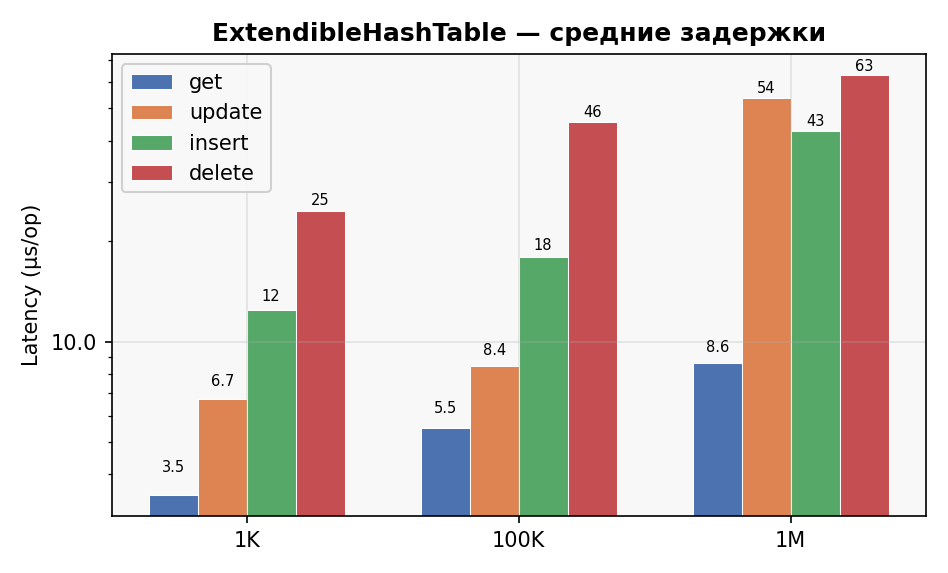

<!-- BEGIN GENERATED:HT_LATENCY_TABLE -->
| Operation | 1K | 100K | 1M |
| --- | --- | --- | --- |
| get | 0.83 | 1.37 | 2.32 |
| update | 1.71 | 2.64 | 3.19 |
| insert | 2.38 | 3.71 | 11.28 |
| delete | 5.29 | 7.80 | 12.39 |
<!-- END GENERATED:HT_LATENCY_TABLE -->

Для insert при переходе от 1K к 1M время растёт примерно в 4.7x. Это ожидаемо для файловой структуры: с увеличением N расширяется рабочий набор directory и bucket, чаще приходится переписывать bucket page, и чаще срабатывает более дорогой сценарий вставки.

### 1.1a Доверительные интервалы

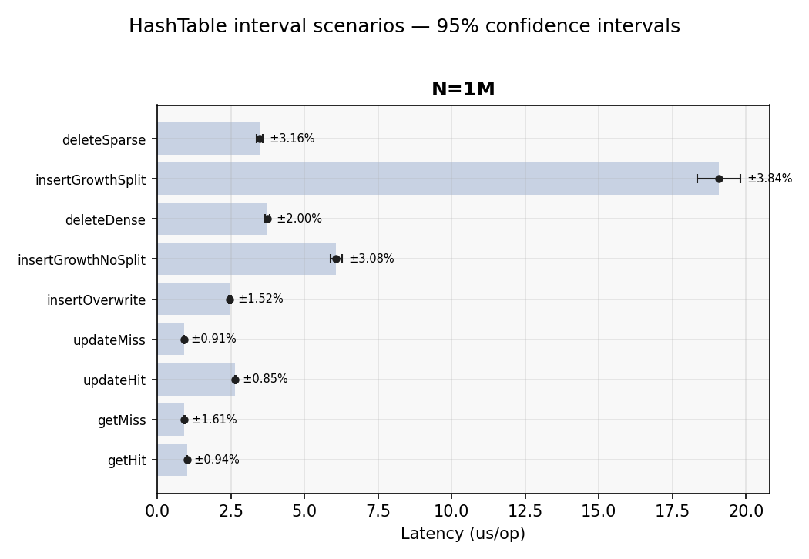

<!-- BEGIN GENERATED:HT_CI_TABLE -->
| Operation | Mode | N | Mean | 95% CI | rel.err |
| --- | --- | --- | --- | --- | --- |
| getHit | avgt | 1M | 1.01 us/op | [1.00, 1.02] us | 0.94% |
| getMiss | avgt | 1M | 0.92 us/op | [0.90, 0.93] us | 1.61% |
| updateHit | avgt | 1M | 2.65 us/op | [2.63, 2.68] us | 0.85% |
| updateMiss | avgt | 1M | 0.91 us/op | [0.90, 0.92] us | 0.91% |
| insertOverwrite | avgt | 1M | 2.47 us/op | [2.43, 2.51] us | 1.52% |
| insertGrowthNoSplit | ss | 1M | 6.08 us/op | [5.89, 6.27] us | 3.08% |
| deleteDense | ss | 1M | 3.75 us/op | [3.67, 3.82] us | 2.00% |
| insertGrowthSplit | ss | 1M | 19.07 us/op | [18.34, 19.80] us | 3.84% |
| deleteSparse | ss | 1M | 3.48 us/op | [3.37, 3.59] us | 3.16% |
<!-- END GENERATED:HT_CI_TABLE -->

### 1.2 Использование дискового пространства

<!-- BEGIN GENERATED:HT_DISK_TABLE -->
| N | bytes/entry |
| --- | --- |
| 1K | 86 |
| 100K | 129 |
| 1M | 115 |
<!-- END GENERATED:HT_DISK_TABLE -->

### 1.3 Профиль CPU

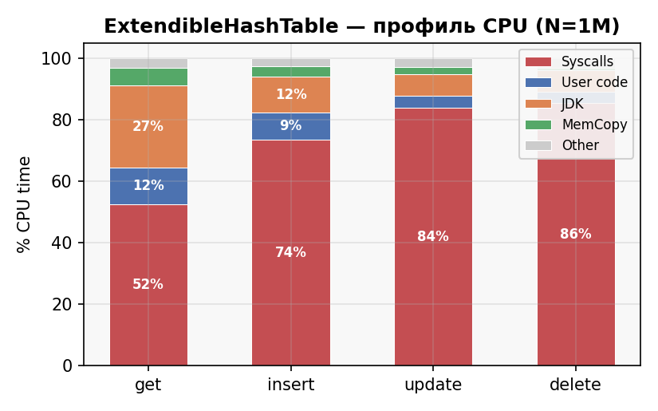

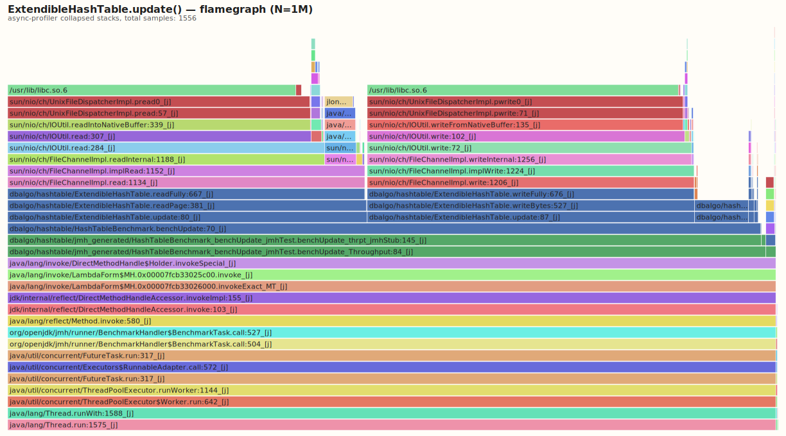

## 2. RandomProjection LSH

In-memory LSH-индекс для поиска близких 3D-точек.

### 2.1 Задержки

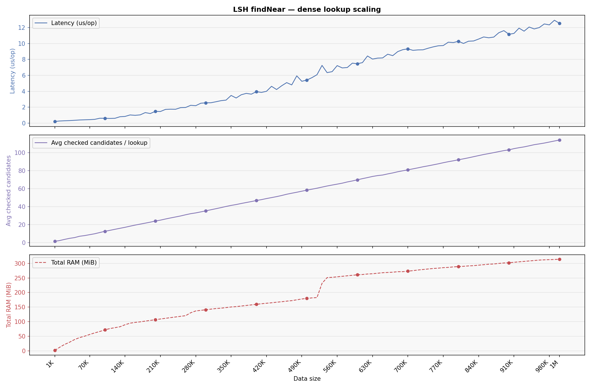

Детальный lookup-scaling прогон идёт по точкам `1K`, затем `10K..1M` с шагом `10K`. График показывает lookup latency, среднее число проверенных кандидатов на lookup и суммарный heap delta структуры в `MiB`.

<!-- BEGIN GENERATED:LSH_LOOKUP_DETAIL_TABLE -->
| N | latency | total RAM | avg checked candidates | avg matches |
| --- | --- | --- | --- | --- |
| 1K | 0.21 us/op | 1 MiB | 1.5 | 1.5 |
| 10K | 0.27 us/op | 11 MiB | 2.3 | 2.3 |
| 20K | 0.30 us/op | 22 MiB | 3.6 | 3.5 |
| 30K | 0.32 us/op | 29 MiB | 4.8 | 4.7 |
| 40K | 0.36 us/op | 38 MiB | 5.6 | 5.5 |
| 50K | 0.40 us/op | 45 MiB | 7.1 | 6.9 |
| 60K | 0.42 us/op | 50 MiB | 7.8 | 7.6 |
| 70K | 0.44 us/op | 56 MiB | 8.9 | 8.6 |
| 80K | 0.48 us/op | 61 MiB | 9.9 | 9.6 |
| 90K | 0.62 us/op | 66 MiB | 11.2 | 11.0 |
| 100K | 0.61 us/op | 72 MiB | 12.6 | 12.3 |
| 110K | 0.60 us/op | 76 MiB | 13.7 | 13.3 |
| 120K | 0.61 us/op | 79 MiB | 14.8 | 14.5 |
| 130K | 0.81 us/op | 82 MiB | 15.9 | 15.6 |
| 140K | 0.85 us/op | 89 MiB | 17.0 | 16.6 |
| 150K | 1.03 us/op | 95 MiB | 18.3 | 17.9 |
| 160K | 0.99 us/op | 97 MiB | 19.5 | 19.0 |
| 170K | 1.04 us/op | 99 MiB | 20.6 | 20.1 |
| 180K | 1.33 us/op | 102 MiB | 21.7 | 21.2 |
| 190K | 1.21 us/op | 104 MiB | 22.8 | 22.2 |
| 200K | 1.49 us/op | 107 MiB | 24.0 | 23.4 |
| 210K | 1.46 us/op | 109 MiB | 25.0 | 24.4 |
| 220K | 1.73 us/op | 111 MiB | 26.3 | 25.7 |
| 230K | 1.76 us/op | 114 MiB | 27.4 | 26.8 |
| 240K | 1.75 us/op | 116 MiB | 28.5 | 27.9 |
| 250K | 1.95 us/op | 118 MiB | 29.6 | 28.9 |
| 260K | 1.97 us/op | 121 MiB | 31.0 | 30.2 |
| 270K | 2.24 us/op | 131 MiB | 32.2 | 31.4 |
| 280K | 2.20 us/op | 137 MiB | 33.0 | 32.2 |
| 290K | 2.50 us/op | 139 MiB | 34.2 | 33.3 |
| 300K | 2.55 us/op | 141 MiB | 35.3 | 34.4 |
| 310K | 2.56 us/op | 143 MiB | 36.5 | 35.6 |
| 320K | 2.69 us/op | 145 MiB | 37.7 | 36.8 |
| 330K | 2.82 us/op | 146 MiB | 38.9 | 37.9 |
| 340K | 2.90 us/op | 148 MiB | 40.2 | 39.2 |
| 350K | 3.48 us/op | 150 MiB | 41.4 | 40.3 |
| 360K | 3.16 us/op | 152 MiB | 42.3 | 41.2 |
| 370K | 3.56 us/op | 154 MiB | 43.5 | 42.4 |
| 380K | 3.74 us/op | 156 MiB | 44.6 | 43.4 |
| 390K | 3.64 us/op | 158 MiB | 45.6 | 44.5 |
| 400K | 3.96 us/op | 159 MiB | 46.8 | 45.6 |
| 410K | 3.86 us/op | 161 MiB | 47.8 | 46.6 |
| 420K | 4.00 us/op | 163 MiB | 49.0 | 47.8 |
| 430K | 4.63 us/op | 165 MiB | 50.0 | 48.8 |
| 440K | 4.22 us/op | 167 MiB | 51.1 | 49.9 |
| 450K | 4.69 us/op | 168 MiB | 52.3 | 51.0 |
| 460K | 5.09 us/op | 170 MiB | 53.8 | 52.4 |
| 470K | 4.80 us/op | 172 MiB | 54.9 | 53.5 |
| 480K | 5.94 us/op | 175 MiB | 56.0 | 54.6 |
| 490K | 5.25 us/op | 178 MiB | 57.1 | 55.7 |
| 500K | 5.41 us/op | 180 MiB | 58.3 | 56.8 |
| 510K | 5.71 us/op | 182 MiB | 59.4 | 57.9 |
| 520K | 6.08 us/op | 183 MiB | 60.5 | 59.0 |
| 530K | 7.25 us/op | 232 MiB | 61.7 | 60.2 |
| 540K | 6.34 us/op | 251 MiB | 62.9 | 61.3 |
| 550K | 6.47 us/op | 252 MiB | 64.0 | 62.4 |
| 560K | 7.22 us/op | 254 MiB | 65.0 | 63.4 |
| 570K | 6.93 us/op | 256 MiB | 66.1 | 64.5 |
| 580K | 6.98 us/op | 257 MiB | 67.4 | 65.8 |
| 590K | 7.53 us/op | 259 MiB | 68.5 | 66.9 |
| 600K | 7.46 us/op | 261 MiB | 69.8 | 68.1 |
| 610K | 7.60 us/op | 262 MiB | 71.1 | 69.3 |
| 620K | 8.43 us/op | 264 MiB | 72.3 | 70.5 |
| 630K | 8.04 us/op | 264 MiB | 73.5 | 71.7 |
| 640K | 8.16 us/op | 266 MiB | 74.5 | 72.6 |
| 650K | 8.19 us/op | 268 MiB | 75.1 | 73.2 |
| 660K | 8.65 us/op | 269 MiB | 76.3 | 74.5 |
| 670K | 8.47 us/op | 270 MiB | 77.4 | 75.5 |
| 680K | 8.98 us/op | 272 MiB | 78.7 | 76.8 |
| 690K | 9.22 us/op | 272 MiB | 79.8 | 77.9 |
| 700K | 9.32 us/op | 273 MiB | 80.8 | 78.9 |
| 710K | 9.14 us/op | 275 MiB | 82.0 | 80.0 |
| 720K | 9.19 us/op | 277 MiB | 83.1 | 81.1 |
| 730K | 9.21 us/op | 279 MiB | 84.3 | 82.2 |
| 740K | 9.40 us/op | 281 MiB | 85.3 | 83.3 |
| 750K | 9.57 us/op | 283 MiB | 86.4 | 84.3 |
| 760K | 9.71 us/op | 284 MiB | 87.5 | 85.5 |
| 770K | 9.74 us/op | 285 MiB | 88.8 | 86.7 |
| 780K | 10.16 us/op | 286 MiB | 89.9 | 87.8 |
| 790K | 10.11 us/op | 288 MiB | 90.9 | 88.8 |
| 800K | 10.28 us/op | 289 MiB | 92.0 | 89.9 |
| 810K | 10.00 us/op | 290 MiB | 93.1 | 90.9 |
| 820K | 10.28 us/op | 291 MiB | 94.2 | 92.0 |
| 830K | 10.31 us/op | 292 MiB | 95.5 | 93.2 |
| 840K | 10.55 us/op | 294 MiB | 96.7 | 94.4 |
| 850K | 10.82 us/op | 296 MiB | 97.9 | 95.6 |
| 860K | 10.71 us/op | 297 MiB | 98.9 | 96.6 |
| 870K | 10.80 us/op | 298 MiB | 100.0 | 97.6 |
| 880K | 11.35 us/op | 300 MiB | 101.1 | 98.7 |
| 890K | 11.61 us/op | 301 MiB | 102.2 | 99.8 |
| 900K | 11.15 us/op | 302 MiB | 103.0 | 100.7 |
| 910K | 11.26 us/op | 304 MiB | 104.4 | 102.0 |
| 920K | 11.93 us/op | 305 MiB | 105.4 | 103.0 |
| 930K | 11.54 us/op | 307 MiB | 106.3 | 103.8 |
| 940K | 12.06 us/op | 308 MiB | 107.5 | 105.0 |
| 950K | 11.82 us/op | 310 MiB | 108.8 | 106.2 |
| 960K | 11.99 us/op | 311 MiB | 109.7 | 107.1 |
| 970K | 12.45 us/op | 312 MiB | 110.6 | 108.0 |
| 980K | 12.33 us/op | 313 MiB | 111.7 | 109.2 |
| 990K | 12.91 us/op | 313 MiB | 112.9 | 110.3 |
| 1M | 12.54 us/op | 314 MiB | 114.0 | 111.4 |
<!-- END GENERATED:LSH_LOOKUP_DETAIL_TABLE -->

Резкий скачок на `1M` означает, что при большом `N` сильно растёт число кандидатов на проверку; дальше время уходит уже не в сам hash, а в filter + distance + sort.

### 2.1a Доверительные интервалы

`LshIntervalBenchmark` остаётся CI-only suite для canonical warm-cache query batches.

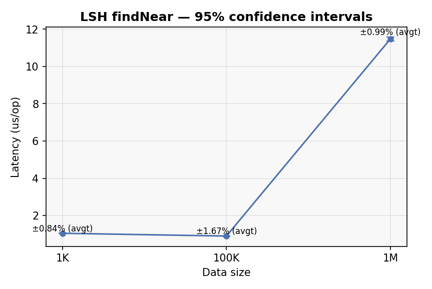

<!-- BEGIN GENERATED:LSH_CI_TABLE -->
| Operation | Mode | N | Mean | 95% CI | rel.err |
| --- | --- | --- | --- | --- | --- |
| findNear | avgt | 1K | 1.05 us/op | [1.04, 1.06] us | 0.84% |
| findNear | avgt | 100K | 0.90 us/op | [0.89, 0.92] us | 1.67% |
| findNear | avgt | 1M | 11.48 us/op | [11.36, 11.59] us | 0.99% |
<!-- END GENERATED:LSH_CI_TABLE -->

### 2.2 Потребление памяти

<!-- BEGIN GENERATED:LSH_MEMORY_TABLE -->
| N | bytes/entry |
| --- | --- |
| 1K | 1240 |
| 100K | 751 |
| 1M | 327 |
<!-- END GENERATED:LSH_MEMORY_TABLE -->

### 2.3 Профиль CPU

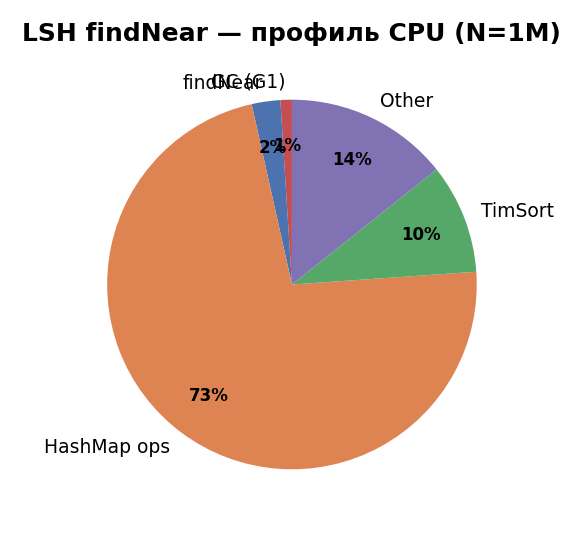

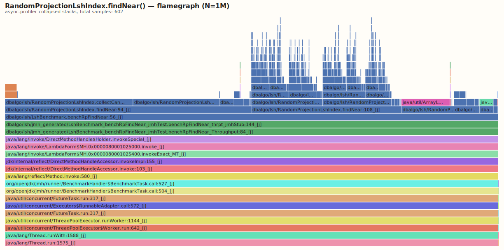

## 3. PerfectHashMap

Статическая двухуровневая FKS-таблица: build дорогой, lookup быстрый и предсказуемый.

### 3.1 Build

<!-- BEGIN GENERATED:PH_BUILD_TABLE -->
| N | build time (ms) |
| --- | --- |
| 1K | 63.32 |
| 100K | 5642.74 |
| 1M | 60867.74 |
<!-- END GENERATED:PH_BUILD_TABLE -->

### 3.2 Lookup

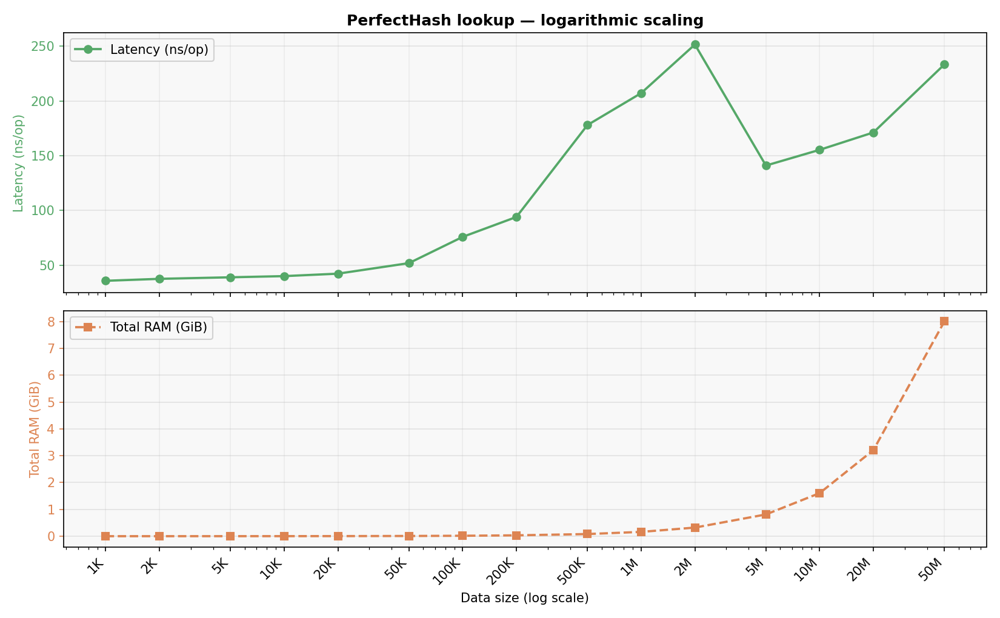

Отдельный scaling-runner строит actual logarithmic lookup-серию от `1K` до `50M` ключей. Для каждой строки показаны lookup latency и суммарный heap delta таблицы. Все точки PerfectHash сглажены медианой по пяти независимым rebuild + lookup прогонам.

<!-- BEGIN GENERATED:PH_LOOKUP_DETAIL_TABLE -->
| N | latency | total RAM | source |
| --- | --- | --- | --- |
| 1K | 35.8 ns/op | 0 MiB | median 5 runs |
| 2K | 37.6 ns/op | 0 MiB | median 5 runs |
| 5K | 39.0 ns/op | 1 MiB | median 5 runs |
| 10K | 40.1 ns/op | 2 MiB | median 5 runs |
| 20K | 42.3 ns/op | 3 MiB | median 5 runs |
| 50K | 51.9 ns/op | 8 MiB | median 5 runs |
| 100K | 75.9 ns/op | 17 MiB | median 5 runs |
| 200K | 94.1 ns/op | 33 MiB | median 5 runs |
| 500K | 178.0 ns/op | 82 MiB | median 5 runs |
| 1M | 207.2 ns/op | 164 MiB | median 5 runs |
| 2M | 251.6 ns/op | 329 MiB | median 5 runs |
| 5M | 141.1 ns/op | 830 MiB | median 5 runs |
| 10M | 155.4 ns/op | 1.61 GiB | median 5 runs |
| 20M | 171.3 ns/op | 3.21 GiB | median 5 runs |
| 50M | 233.4 ns/op | 8.00 GiB | median 5 runs |
<!-- END GENERATED:PH_LOOKUP_DETAIL_TABLE -->

### 3.2a Доверительные интервалы

`PerfectHash` использует два CI-only suite: `PerfectHashLookupIntervalBenchmark` для steady-state lookup и `PerfectHashBuildIntervalBenchmark` для build path.

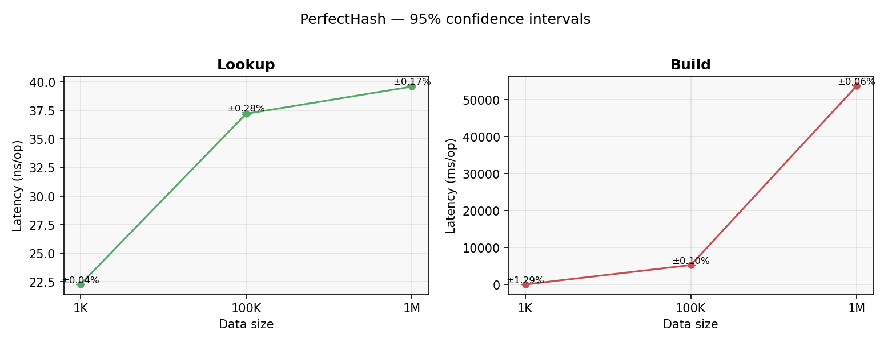

**Lookup CI**

<!-- BEGIN GENERATED:PH_LOOKUP_CI_TABLE -->
| Operation | Mode | N | Mean | 95% CI | rel.err |
| --- | --- | --- | --- | --- | --- |
| lookup | avgt | 1K | 28.77 ns/op | [28.57, 28.98] ns | 0.71% |
| lookup | avgt | 100K | 50.39 ns/op | [49.39, 51.39] ns | 1.98% |
| lookup | avgt | 1M | 84.79 ns/op | [83.59, 86.00] ns | 1.42% |
<!-- END GENERATED:PH_LOOKUP_CI_TABLE -->

**Build CI**

<!-- BEGIN GENERATED:PH_BUILD_CI_TABLE -->
| Operation | Mode | N | Mean | 95% CI | rel.err |
| --- | --- | --- | --- | --- | --- |
| build | ss | 1K | 60.26 ms/op | [59.54, 60.97] ms | 1.19% |
| build | ss | 100K | 5695.30 ms/op | [5652.40, 5738.20] ms | 0.75% |
| build | ss | 1M | 61517.20 ms/op | [60387.22, 62647.19] ms | 1.84% |
<!-- END GENERATED:PH_BUILD_CI_TABLE -->

### 3.3 Память и структура

<!-- BEGIN GENERATED:PH_MEMORY_TABLE -->
| N | heap bytes/entry | total slots | slots/entry |
| --- | --- | --- | --- |
| 1K | 100 | 4110 | 4.11 |
| 100K | 79 | 409484 | 4.09 |
| 1M | 79 | 4040136 | 4.04 |
<!-- END GENERATED:PH_MEMORY_TABLE -->

### 3.4 Профиль CPU

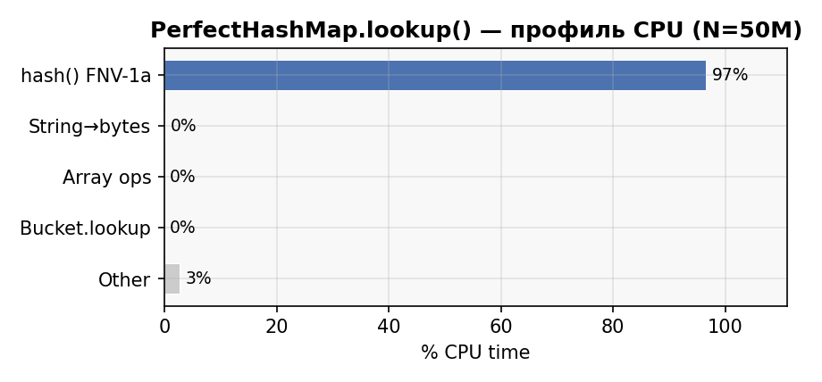

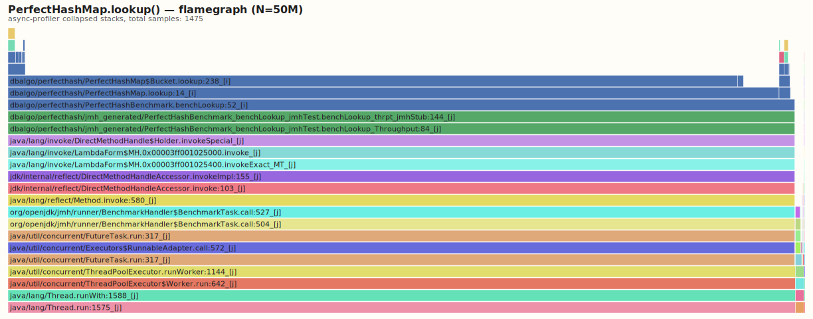

## 4. Сравнение памяти

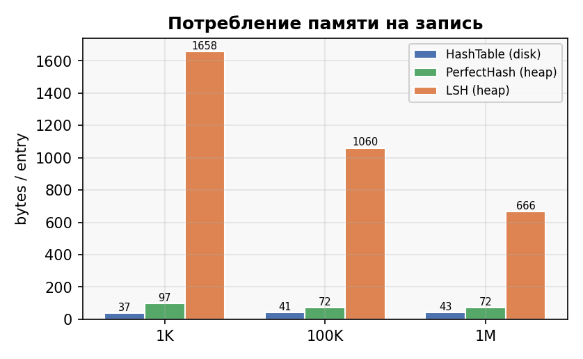

<!-- BEGIN GENERATED:MEMORY_COMPARISON_TABLE -->
| Structure | 1K | 100K | 1M |
| --- | --- | --- | --- |
| HashTable (disk) | 86 | 129 | 115 |
| PerfectHash (heap) | 100 | 79 | 79 |
| LSH (heap) | 1240 | 751 | 327 |
<!-- END GENERATED:MEMORY_COMPARISON_TABLE -->
